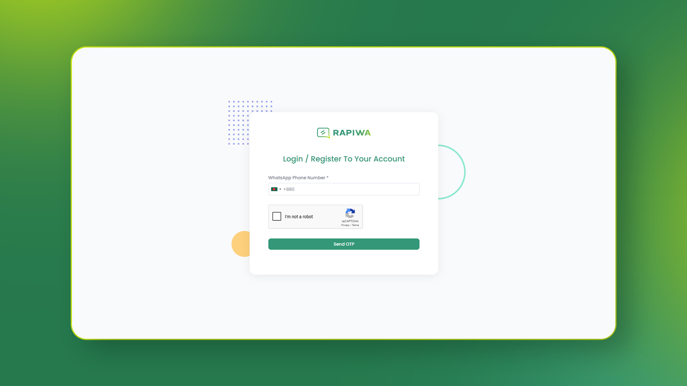
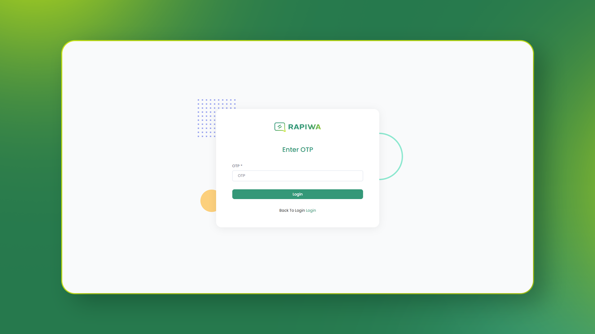
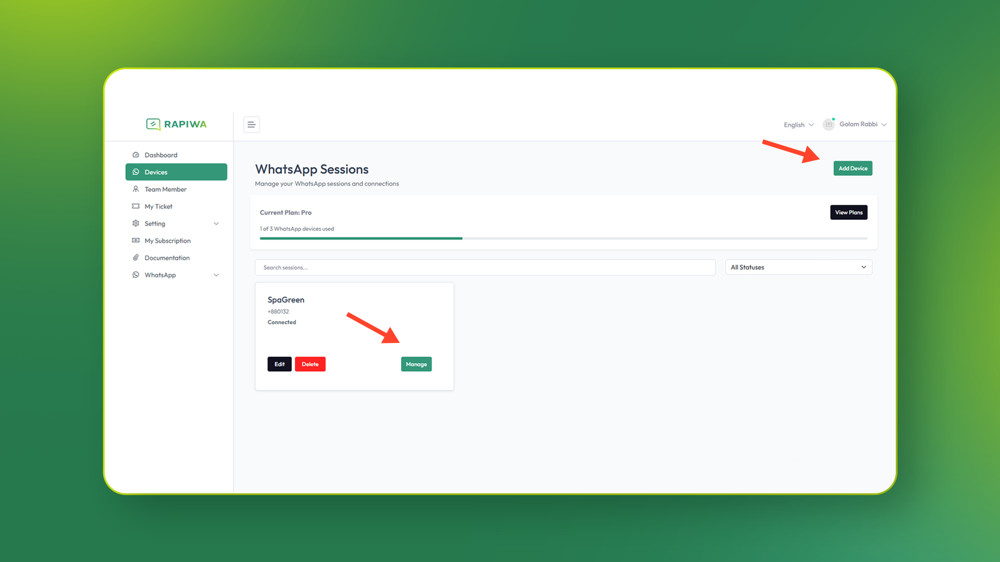
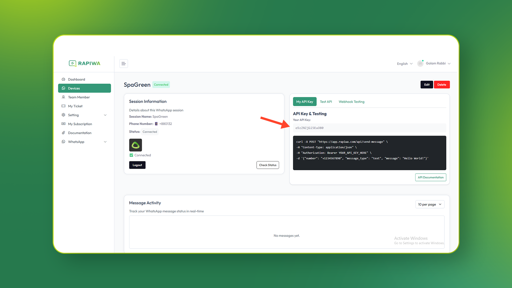

# API Key

An **API Key** is required to authenticate and interact with the **Rapiwa API**.  
Follow the steps below to generate your API Key.

---

## 1. Create a Rapiwa Account
- Go to [app.rapiwa.com/login](https://app.rapiwa.com/login).
- Enter your **WhatsApp Number** to create an account.

---

## 2. Verify with OTP
- Check your **WhatsApp inbox** for the OTP sent by Rapiwa.
- Enter the OTP in the verification field to continue.

---

## 3. Subscribe to a Plan
- Choose and activate the subscription plan that best fits your needs.

---

## 4. Open the Devices Page
- From your dashboard, navigate to the [Devices Page](https://app.rapiwa.com/client/session).

---

## 5. Add a Device
- Click **Add Device** to connect your WhatsApp device with Rapiwa.

---

## 6. Manage Your Device
- Once added, click **Manage** next to your device.

---

## 7. Retrieve Your API Key
- On the device management screen, you’ll see your **API Key**.

---

> 💡 **Tip:** Keep your API Key **secure**. Never share it publicly. If you believe it’s been compromised, regenerate it immediately.
