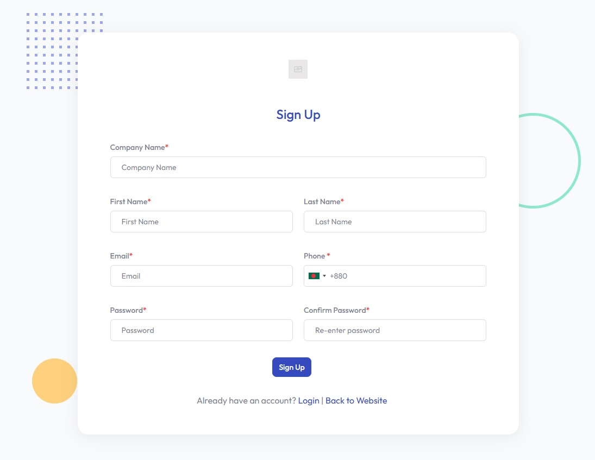
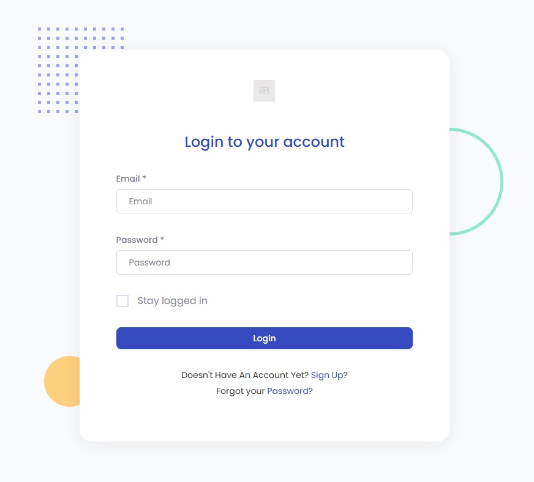

# API Key

An **API Key** is required to authenticate and interact with the Rapiwa API.  
Follow the steps below to generate your API Key.

---

## 1. Create a Rapiwa Account
- Visit [rapiwa.com/register](https://rapiwa.com/register) and complete the registration form.

---

## 2. Log In to Your Account
- Go to [rapiwa.com/login](https://rapiwa.com/login) and sign in with your credentials.

---

## 3. Subscribe to a Plan
- Choose and activate a plan that suits your needs.

---

## 4. Navigate to the Session Page
- Open the [Session Page](https://rapiwa.com/client/session) from your dashboard.

---

## 5. Add a Device
- Click **Add Device** to connect your WhatsApp device to Rapiwa.

---

## 6. Manage Your Device
- Click the **Manage** button next to the device you have added.

---

## 7. Retrieve Your API Key
- Your **API Key** will be displayed on the device management screen.

---

> 💡 **Tip:** Keep your API Key secure. Never share it publicly.
