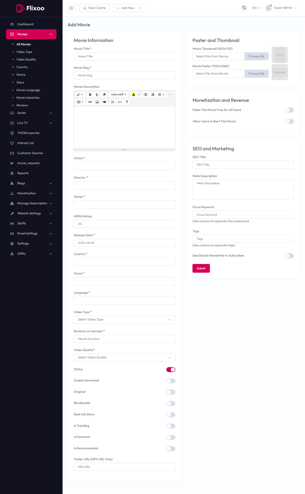

# Add Movie

To configure **Add Movie**, follow these steps:

1. From the left sidebar, go to **Movies**.  
2. Click on **Add Movie**.  
3. Enter the required details for adding a new movie.

## Available Options

### Movie Information
- **Movie Title** – Enter the title of the movie.  
- **Movie Slug** – Enter a unique slug for the movie.  
- **Movie Description** – Provide a detailed description of the movie.  
- **Actors** – Enter the names of the actors.  
- **Director** – Enter the name of the director.  
- **Writer** – Enter the name of the writer.  
- **IMDb Rating** – Enter the IMDb rating (e.g., 00).  
- **Release Date** – Enter the release date (e.g., 2025-08-18).  
- **Country** – Select the country.  
- **Genre** – Select the genre.  
- **Language** – Select the language.  
- **Video Type** – Select the video type from the dropdown.  
- **Runtime (in minutes)** – Enter the runtime in minutes.  
- **Video Quality** – Select the video quality from the dropdown.  
- **Status** – Toggle to enable or disable the movie status.  
- **Enable Download** – Toggle to enable or disable download option.  
- **Original** – Toggle to mark as original.  
- **Blockbuster** – Toggle to mark as blockbuster.  
- **Real Life Story** – Toggle to mark as real life story.  
- **Is Trending** – Toggle to mark as trending.  
- **Is Featured** – Toggle to mark as featured.  
- **Is Recommended** – Toggle to mark as recommended.  
- **Trailer URL (MP4 URL Only)** – Enter the trailer URL.

### Poster and Thumbnail
- **Movie Thumbnail (500x750)** – Upload the movie thumbnail.  
- **Movie Poster (1920x1080)** – Upload the movie poster.

### Monetization and Revenue
- **Make This Movie Free for All Users** – Toggle to make the movie free.  
- **Allow Users to Rent This Movie** – Toggle to allow renting.

### SEO and Marketing
- **SEO Title** – Enter the SEO title.  
- **SEO URL** – Enter the SEO URL.  
- **Meta Description** – Enter the meta description.  
- **Focus Keyword** – Enter focus keywords (use commas to separate).  
- **Tags** – Enter tags (use commas to separate).  
- **Send Email Newsletter to Subscriber** – Toggle to send email newsletter.

After entering the details, click the **Submit** button to save settings.

