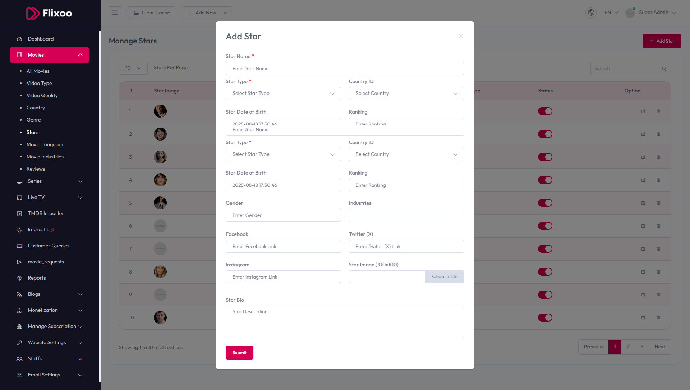

# Add Star

To configure **Add Star**, follow these steps:

1. From the left sidebar, go to **Movies**.  
2. Click on **Manage Stars**.  
3. Click on **Add Star**.  
4. Enter the required details for adding a new star.

## Available Options
- **Star Name** – Enter the name of the star.  
- **Star Type** – Select the star type from the dropdown.  
- **Star Date of Birth** – Enter the date of birth (e.g., 2025-08-18).  
- **Country ID** – Select the country from the dropdown.  
- **Ranking** – Enter the ranking.  
- **Gender** – Enter the gender.  
- **Industries** – Enter the industries.  
- **Facebook** – Enter the Facebook link.  
- **Twitter (X)** – Enter the Twitter (X) link.  
- **Instagram** – Enter the Instagram link.  
- **Star Bio** – Enter a description of the star.  
- **Star Image (100x100)** – Upload the star image.

After entering the details, click the **Submit** button to save settings.

