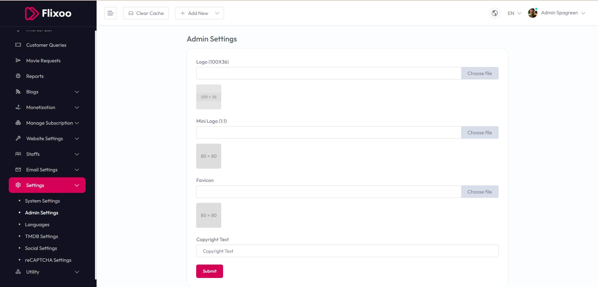

# Admin Settings

To manage **Admin Settings**, follow these steps:

1. From the left sidebar, go to **Settings**.  
2. Click on **Admin Settings**.  
3. Update your admin panel branding information as needed.  

## Available Options

- **Logo (100x36)** – Upload the main logo for the admin panel (recommended size: 100x36 pixels).  
- **Mini Logo (1:1)** – Upload a square logo, usually displayed in compact areas (recommended size: 80x80 pixels).  
- **Favicon** – Upload the favicon icon that appears in the browser tab (recommended size: 80x80 pixels).  
- **Copyright Text** – Add your custom copyright text that will be shown in the footer.  

After making changes, click the **Submit** button to save settings.  

