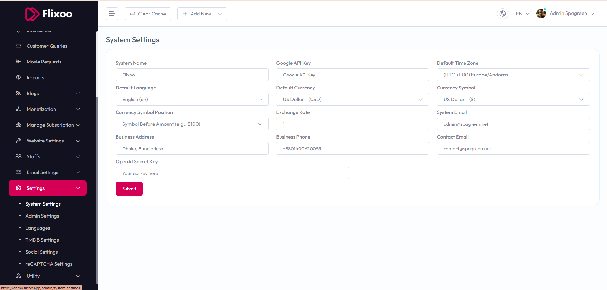

# System Settings

To manage **System Settings**, follow these steps:

1. From the left sidebar, go to **Settings**.  
2. Click on **System Settings**.  
3. Update and configure your system information as required.  

## Available Options

- **System Name** – Set the name of your platform.  
- **Google API Key** – Add your Google API key for integrations.  
- **Default Time Zone** – Choose the system’s default time zone.  
- **Default Language** – Select the preferred language.  
- **Default Currency** – Define your preferred currency.  
- **Currency Symbol** – Select the symbol for your chosen currency.  
- **Currency Symbol Position** – Choose whether the symbol appears before or after the amount (e.g., `$100` or `100$`).  
- **Exchange Rate** – Set the exchange rate for currency conversion.  
- **Business Address** – Enter your company’s address.  
- **Business Phone** – Provide your business contact number.  
- **System Email** – Set the default email address used by the system.  
- **Contact Email** – Add the main contact email address.  
- **Registration Enable** – Enable or disable user registration.  

After making changes, click the **Submit** button to save settings.  

