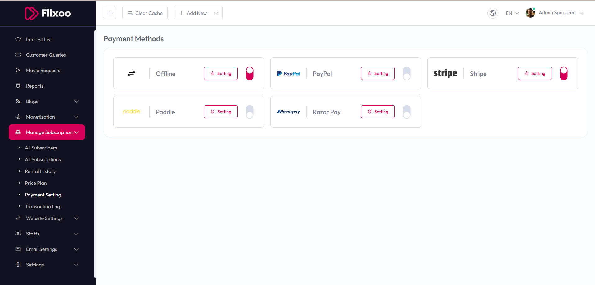

# Payment Methods

To configure **Payment Methods**, follow these steps:

1. From the left sidebar, go to **Manage Subscription**.  
2. Click on **Payment Setting**.  
3. Manage the available payment methods and their settings as needed.

## Available Options

- **Offline** – Toggle to enable or disable offline payment method.  
- **PayPal** – Toggle to enable or disable PayPal payment method.  
- **Stripe** – Toggle to enable or disable Stripe payment method.  
- **Paddle** – Toggle to enable or disable Paddle payment method.  
- **Razor Pay** – Toggle to enable or disable Razor Pay payment method.  

Click the **Setting** button for each payment method to configure its details. Use the toggle switches to enable or disable the respective payment methods.

