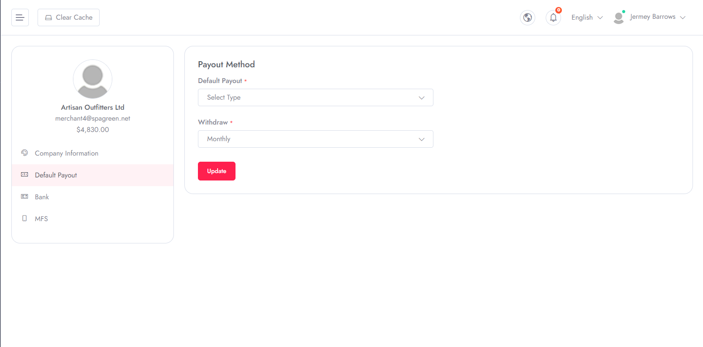

# Default Payout Method
To Manage **Default Payout Method** follow the procedures…

- Merchant can have multiple account registered for the system for payment.
- From those multiple account, he can select the default payment account for his system.

