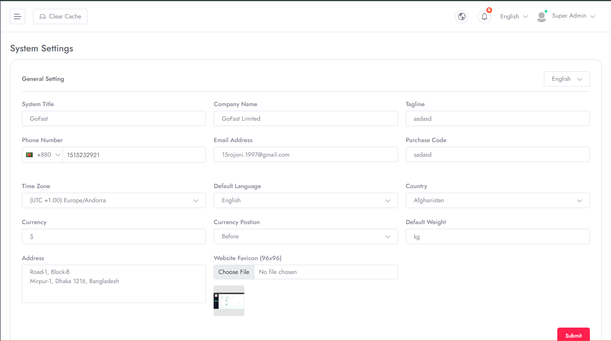

# General Settings

To Manage **General Settings** follow the procedures…

- Select **General Settings** in the left menu of **System Settings**
- You can update your own business information from here. 
- For example, **Company Name**,**Brand Tagline**,**Default Language**,**Currency**,**Time Zone** and many more preferable settings can be updated from here.

