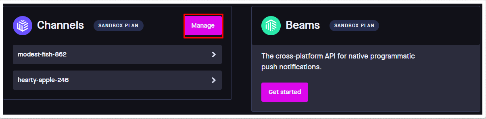
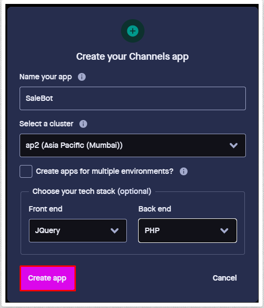
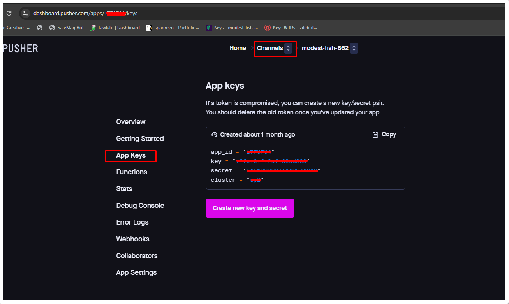

# Pusher Settings

To Manage **Pusher Settings** follow the procedures…

- Select **Pusher** in the left menu of **System Settings**
- To use Pusher services, you must first register on the website. Click https://pusher.com/ to register if you haven’t registered already.
- Click Manage under the channels section of pusher.com after logging in with your account like this

- On the right corner, select Create App. You'll get a popup window to start your new application.
 - Give your app a name, like this: SaleBot
 -  Choose a cluster: Pusher.com will choose your cluster by default; if necessary, you can modify it. 
 - You can read more here what is cluster: https://pusher.com/docs/clusters
 - Front-end tech stack – Select jQuery. 
 - Back-end tech stack – Select PHP.

- Click the App Keys sidebar menu once the app has been built, and you will see the app keys

- Copy the keys individually, one by one, and paste them into the Pusher settings, then active the status and click on the submit button.
