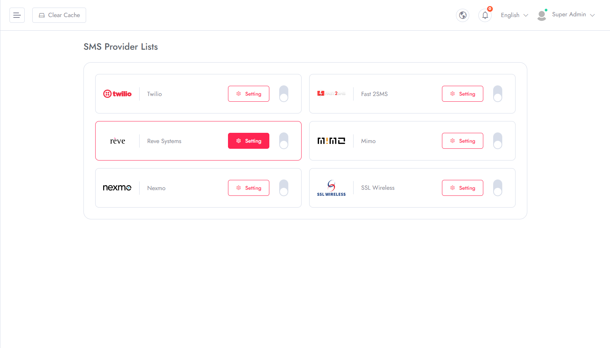
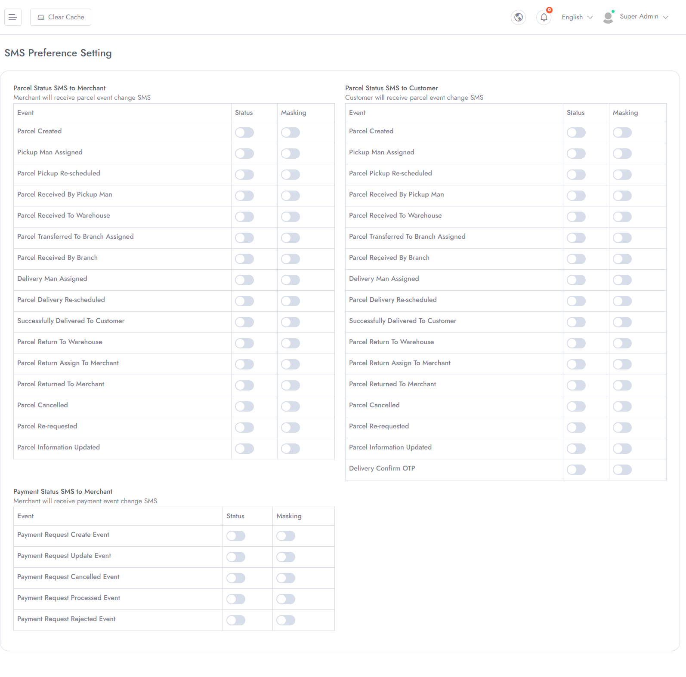

# SMS Settings

To Manage **SMS Settings** follow the procedures…

- Select **SMS** in the left menu of **Admin Panel**
- You can set up any of the following platforms for SMS usage in your mobile app.

- You can decide which permission will be given for which roles and also set restrictions according to your business model.
- To get proper notifications, you must set up SMS service provider credentials correctly and set the preferences.
- Otherwise, SMS might not work properly

