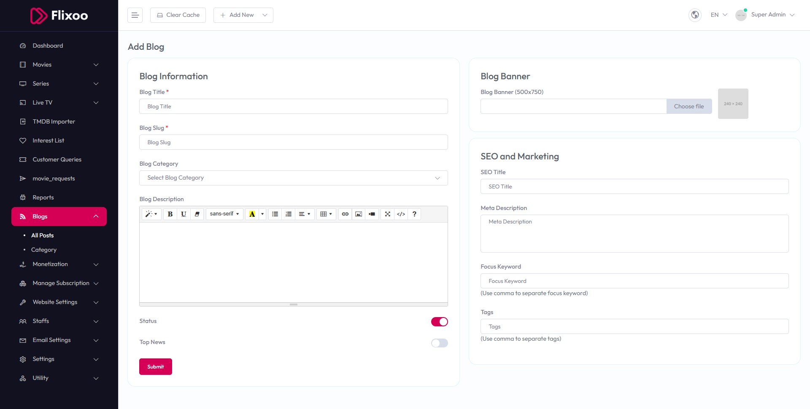

# Add New Blog

To configure **Add New Blog**, follow these steps:

1. From the left sidebar, go to **Blogs**.  
2. Click on **Add New Blog**.  
3. Enter the required details for adding a new blog post.

## Available Options
- **Title** – Enter the title of the blog post.  
- **Slug** – Enter a unique slug for the blog post.  
- **Blog Category** – Select the category from the dropdown.  
- **Blog Description** – Provide a detailed description of the blog post.  
- **Blog Image (1200x600)** – Upload the blog image.  
- **SEO Title** – Enter the SEO title.  
- **Meta Description** – Enter the meta description.  
- **Focus Keyword** – Enter focus keywords (use commas to separate).  
- **Tags** – Enter tags (use commas to separate).  
- **Status** – Toggle to enable or disable the blog post status.

After entering the details, click the **Submit** button to save settings.

