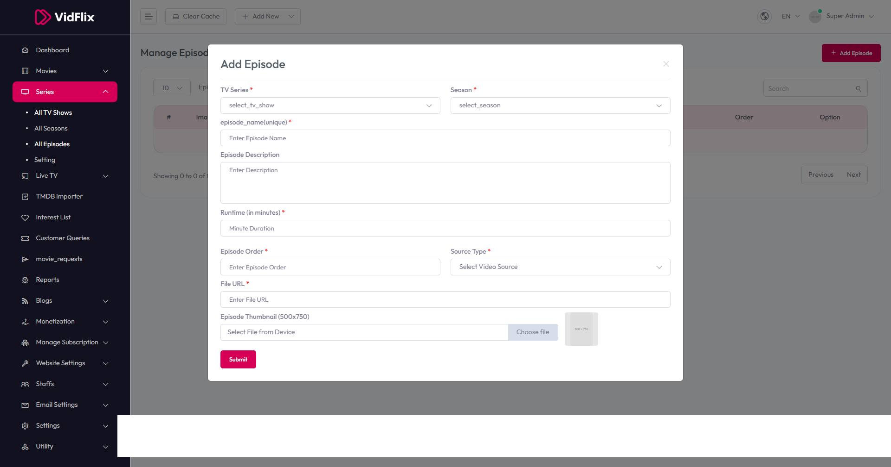

# Add Episode

To configure **Add Episode**, follow these steps:

1. From the left sidebar, go to **Series**.  
2. Click on **All Episodes**.  
3. Click on **Add Episode**.  
4. Enter the required details for adding a new episode.

## Available Options

- **TV Series** – Select the TV series from the dropdown.  
- **Season** – Select the season from the dropdown.  
- **Episode Name/Unique** – Enter a unique name for the episode.  
- **Episode Description** – Provide a detailed description of the episode.  
- **Runtime (in minutes)** – Enter the runtime in minutes.  
- **Episode Order** – Enter the episode order.  
- **File URL** – Enter the file URL.  
- **Source Type** – Select the source type from the dropdown.  
- **Order** – Enter the order number.  
- **Episode Thumbnail (500x750)** – Upload the episode thumbnail.

After entering the details, click the **Submit** button to save settings.

