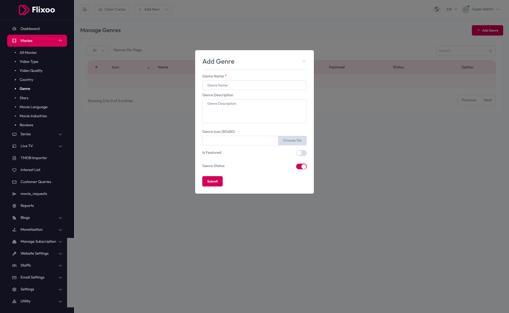

# Add Genre

To configure **Add Genre**, follow these steps:

1. From the left sidebar, go to **Movies**.  
2. Click on **Genre**.  
3. Click on **Add Genre**.  
4. Enter the required details for adding a new genre.

## Available Options
- **Genre Name** – Enter the name of the genre.  
- **Genre Description** – Provide a detailed description of the genre.  
- **Genre Icon (80x80)** – Upload the genre icon.  
- **Is Featured** – Toggle to mark as featured.  
- **Genre Status** – Toggle to enable or disable the genre status.

After entering the details, click the **Submit** button to save settings.

