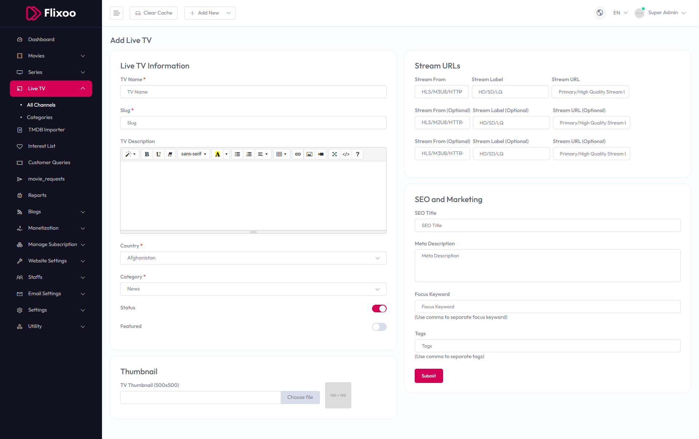

# Add Live TV

To configure **Add Live TV**, follow these steps:

1. From the left sidebar, go to **Live TV**.  
2. Click on **Add Live TV**.  
3. Enter the required details for adding a new live TV channel.

## Available Options

### Live TV Information
- **TV Name** – Enter the name of the TV channel.  
- **Slug** – Enter a unique slug for the TV channel.  
- **TV Description** – Provide a detailed description of the TV channel.  
- **Country** – Select the country (e.g., Afghanistan).  
- **Category** – Select the category (e.g., News).  
- **Status** – Toggle to enable or disable the TV channel status.  
- **Featured** – Toggle to mark as featured.  

### Stream URLs
- **Stream From** – Enter the stream source (e.g., HLS/M3U8/HTTP, HD/SD/LQ).  
- **Stream Label (Optional)** – Enter an optional label for the stream.  
- **Stream URL (Optional)** – Enter the stream URL (e.g., Primary/High Quality Stream 1).  
- **Stream From (Optional)** – Enter an optional stream source (e.g., HLS/M3U8/HTTP, HD/SD/LQ).  
- **Stream Label (Optional)** – Enter an optional label for the stream.  
- **Stream URL (Optional)** – Enter the optional stream URL (e.g., Primary/High Quality Stream 1).  

### Thumbnail
- **TV Thumbnail (500x500)** – Upload the TV thumbnail.

### SEO and Marketing
- **SEO Title** – Enter the SEO title.  
- **Meta Description** – Enter the meta description.  
- **Focus Keyword** – Enter focus keywords (use commas to separate).  
- **Tags** – Enter tags (use commas to separate).

After entering the details, click the **Submit** button to save settings.

