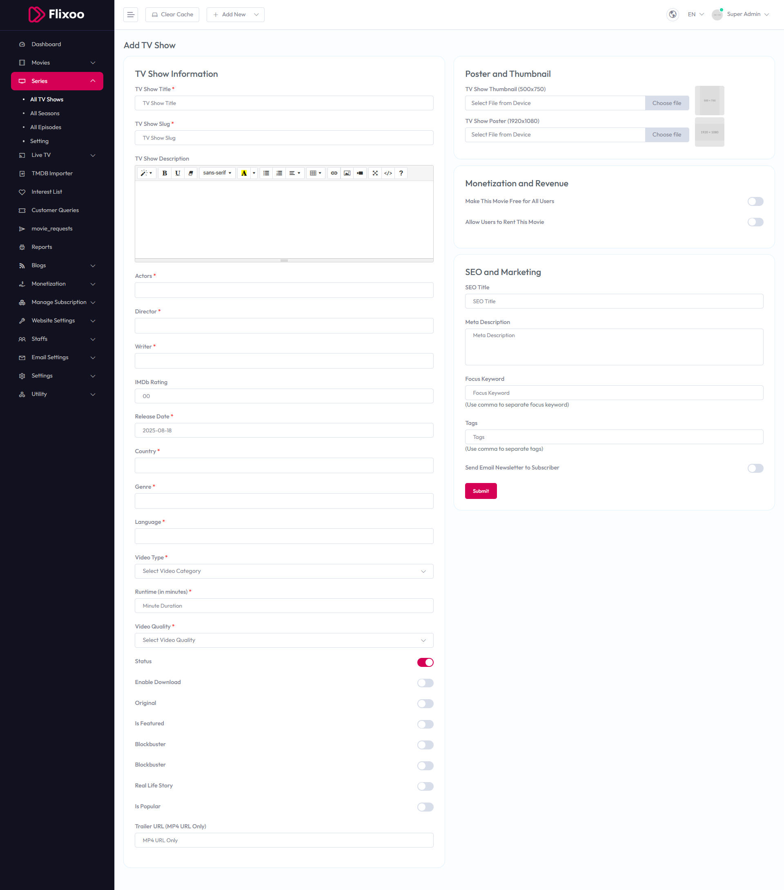

# Add TV Show

To configure **Add TV Show**, follow these steps:

1. From the left sidebar, go to **Series**.  
2. Click on **Add TV Show**.  
3. Enter the required details for adding a new TV show.

## Available Options

### TV Show Information
- **TV Show Title** – Enter the title of the TV show.  
- **TV Show Slug** – Enter a unique slug for the TV show.  
- **TV Show Description** – Provide a detailed description of the TV show.  
- **Actors** – Enter the names of the actors.  
- **Director** – Enter the name of the director.  
- **Writer** – Enter the name of the writer.  
- **IMDb Rating** – Enter the IMDb rating (e.g., 00).  
- **Release Date** – Enter the release date (e.g., 2025-08-18).  
- **Country** – Select the country.  
- **Genre** – Select the genre.  
- **Language** – Select the language.  
- **Video Type** – Select the video category from the dropdown.  
- **Runtime (in minutes)** – Enter the runtime in minutes.  
- **Video Quality** – Select the video quality from the dropdown.  
- **Status** – Toggle to enable or disable the TV show status.  
- **Enable Download** – Toggle to enable or disable download option.  
- **Original** – Toggle to mark as original.  
- **Blockbuster** – Toggle to mark as blockbuster.  
- **Real Life Story** – Toggle to mark as real life story.  
- **Is Popular** – Toggle to mark as popular.  
- **Trailer URL (MP4 URL Only)** – Enter the trailer URL.

### Poster and Thumbnail
- **TV Show Thumbnail (500x750)** – Upload the TV show thumbnail.  
- **TV Show Poster (1920x1080)** – Upload the TV show poster.

### Monetization and Revenue
- **Make This TV Show Free for All Users** – Toggle to make the TV show free.  
- **Allow Users to Rent This TV Show** – Toggle to allow renting.

### SEO and Marketing
- **SEO Title** – Enter the SEO title.  
- **SEO URL** – Enter the SEO URL.  
- **Meta Description** – Enter the meta description.  
- **Focus Keyword** – Enter focus keywords (use commas to separate).  
- **Tags** – Enter tags (use commas to separate).  
- **Send Email Newsletter to Subscriber** – Toggle to send email newsletter.

After entering the details, click the **Submit** button to save settings.

