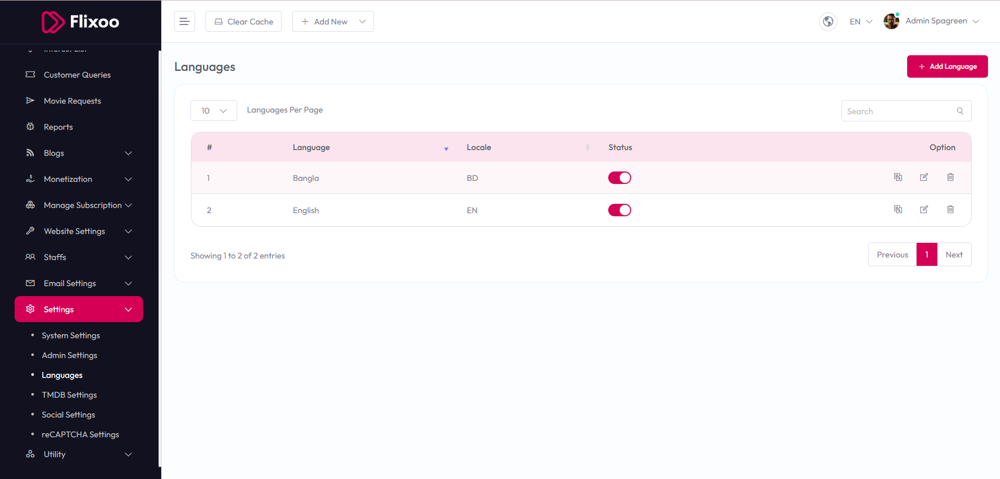

# Languages Settings

To configure **Languages Settings**, follow these steps:

1. From the left sidebar, go to **Settings**.  
2. Click on **Languages**.  
3. Manage the available languages and their settings as needed.

## Available Options

- **#** – Displays the sequence number of the language.  
- **Language** – Shows the name of the language (e.g., Bangla, English).  
- **Locale** – Indicates the locale code (e.g., BD, EN).  
- **Status** – Toggle to enable or disable the language.  
- **Option** – Provides actions like edit or delete for each language entry.

After making changes, use the **Add Language** button to add new languages or the **Save** option to update existing settings.

