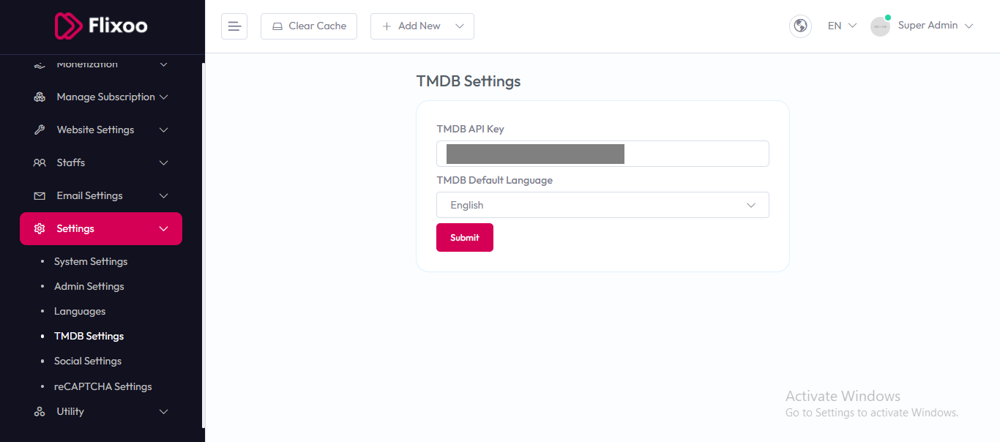

# TMDB Settings

To configure **TMDB (The Movie Database) Settings**, follow these steps:

1. From the left sidebar, go to **Settings**.  
2. Click on **TMDB Settings**.  
3. Enter the required API details for TMDB integration.  

## Available Options

- **TMDB API Key** – Enter your TMDB API key to connect the system with The Movie Database for fetching movies, TV shows, and metadata.  
- **TMDB Default Language** – Choose the default language for TMDB content (e.g., English, Spanish, etc.).  

After entering the details, click the **Submit** button to save settings.  

---

## How to Get a TMDB Account and API Key

To use TMDB services, you need an account and API key. Follow these steps:

1. Go to the official website: [https://www.themoviedb.org](https://www.themoviedb.org).  
2. Click **Sign Up** and create a free account.  
3. After logging in, go to your **Settings** > **API** section.  
4. Click on **Create** or **Request an API Key**.  
5. Choose **Developer** for personal or testing use, or **Commercial** if you plan to use it in a business project.  
6. Fill in the required details and submit the request.  
7. Once approved, your **API Key** will be visible in your account dashboard.  

Copy this key and paste it into the **TMDB API Key** field in your system settings.  

---

:::tip
If you want to test your TMDB API key, you can try it in your browser with this URL:  
`https://api.themoviedb.org/3/movie/popular?api_key=YOUR_API_KEY`
:::
