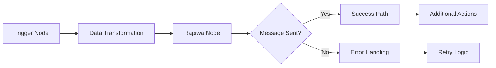

## Automate WhatsApp Messaging with n8n and Rapiwa

Integrate **Rapiwa** with **n8n** to automate WhatsApp messaging at scale. This guide explains how to configure your Rapiwa account, retrieve your Device Key, and connect it to n8n for seamless message automation.

---

## Overview

[Rapiwa](https://docs.rapiwa.com/) is a reliable API platform that provides **unlimited WhatsApp messaging** capabilities.  
Using **n8n**, a visual workflow automation tool, you can easily send and manage WhatsApp messages without writing complex code.

---

## Prerequisites

Before you begin, make sure you have:

1. **A Rapiwa Account**  
   * Sign up at [rapiwa.com](https://rapiwa.com/).  
   * You’ll need to generate a **Device Key** to authenticate your API requests.

2. **An n8n Instance**  
   * Access to n8n (cloud or self-hosted).  
   * Basic understanding of building workflows using HTTP Request nodes.

---

## Getting Started with Rapiwa

### Step 1: Create a Rapiwa Account

1. Visit [app.rapiwa.com/login](https://app.rapiwa.com/login).  
2. Enter your **WhatsApp number** to register.  
3. You’ll receive an **OTP** on WhatsApp — enter it to verify your account.

---

### Step 2: Add a Device

1. From your Rapiwa dashboard, go to the **Devices** page.  
2. Click **Add Device** to connect your WhatsApp number.  

Once created, your device will appear on the **Devices** list.

---

### Step 3: Retrieve Your Device Key

* After adding your device, click **Manage** next to it.  
* Scan the QR code to connect your WhatsApp account to Rapiwa.  
* Once connected, your **Device Key** will be displayed.  
* You can also view connection status, send test messages, and manage your WhatsApp instance from this screen.


---

# Connect Rapiwa to n8n

Now that you have **Rapiwa** set up, let’s connect it to **n8n** to automate your WhatsApp workflows.

---

## 1. Set up your n8n workflow

1. **Log in** to your n8n account.  
2. Click **+ New Workflow** to create a new workflow.  
3. Add a **trigger node** of your choice.  
   Popular triggers include **Google Forms**, **Jotform**, **ClickUp**, or a **Schedule trigger**.  
4. Connect and configure your trigger according to your use case.

---

## Rapiwa Trigger Node

The **Rapiwa trigger node** enables your workflow to respond automatically to incoming WhatsApp messages. This setup is optional but recommended for reactive communication flows.

### Add Rapiwa Trigger Node

1. Click the **+** button in your workflow canvas to add a new node.  
2. Search for **“Rapiwa”** in the node library search bar.  
3. Select the node displaying the official **Rapiwa logo**.  
4. From the available trigger options, choose **On new Incoming message event**.  


Once configured, the trigger node will automatically listen for incoming messages and initiate your workflow whenever a new message is received.

---

### Configure Authentication Credentials

**Webhook URL Configuration:**

1. In the **Rapiwa Trigger** node parameters, locate the **Webhook URLs** section at the top.  
2. Select **Production URL** and copy the generated URL.  
3. Store this URL securely — you’ll need it for the credential setup.


**Credential Creation:**

1. In the **Credential to connect with** dropdown, click **+ Create new credential**.  
2. Select **Rapiwa Trigger API** as your connection method.  
3. Enter your **Rapiwa Device Key** in the **API Key** field.  
4. Paste the **Production URL** you copied earlier into the **Production URL** field.  
5. Click **Save** to securely store your credentials.

  

> ⚠️ Never share your Device Key publicly.

---

### Test and Activate Workflow

**Response Configuration:**

* **Immediately:** Responds as soon as the trigger fires.  
* **When Last Node Finishes:** Waits for the entire workflow to complete before responding.

**Testing:**

1. Click **Execute Step** on the Rapiwa node to run a test.  
2. Verify the connection is working by checking for a success confirmation.  
3. Review any error messages if the test fails and adjust your configuration accordingly.  

Once activated, your workflow will automatically process incoming messages according to your configured logic.

---

## 2. Add the Rapiwa Node

1. Click the **+** button to add a new node.  
2. Search for **“Rapiwa”** in the node library.  
3. Select the node with the official **Rapiwa logo**.  
4. After selecting the Rapiwa node, choose **Send message via Rapiwa** from the available actions menu.


---

## 3. Configure Rapiwa Credentials

**Credential Setup:**

1. In the **Rapiwa node** settings, find the **Credential to connect with** dropdown.  
2. Select **+ Create new credential**.  
3. Enter your **Rapiwa Device Key**.  
4. Click **Save** to store your credential securely.

---

## 4. Configure Your Message

In the Rapiwa node configuration:

* **Resource:** `Send Message`  
* **Operation:** `Send message via Rapiwa`

**Required Fields:**

| Field       | Type   | Description                                                          |
| ----------- | ------ | -------------------------------------------------------------------- |
| **Number**  | string | Recipient’s phone number (with country code).                        |
| **Message** | string | The message text to send. You can use variables from previous nodes. |

**Example:**

### Header

```http
Content-Type: application/json
Authorization: Bearer Your_Device_Key
```

### Body

```json
{
  "number": "88017XXXXXXXX",
  "message_type": "text",
  "message": "Hello from n8n and Rapiwa!"
}
```

Click **Show Optional Parameters** if you wish to include additional fields like media or buttons (available in Rapiwa API).

---

## 5. Test and activate your workflow

1. Click **Test Step** on the Rapiwa node to verify it’s working correctly.
2. If the test is successful, you’ll see a confirmation message in the execution log.
3. Click **Done** to return to your workflow.
4. Click **Save** to save your workflow.
5. Toggle the **Active** switch in the top-right corner to activate your automation.

---

## Example use cases

| Use Case                   | Description                                                         |
| -------------------------- | ------------------------------------------------------------------- |
| **Customer Onboarding**    | Send a welcome message when a new customer signs up.                |
| **Order Notifications**    | Notify customers when their order status changes.                   |
| **Appointment Reminders**  | Automatically send reminders before scheduled appointments.         |
| **Lead Follow-up**         | Send personalized messages to new leads from your form submissions. |
| **Support Ticket Updates** | Notify customers when their support ticket status changes.          |

---

## Workflow Diagram

**Sample Rapiwa n8n Workflow:**



---

## Troubleshooting

| Issue               | Possible Cause                          | Solution                                                    |
| ------------------- | --------------------------------------- | ----------------------------------------------------------- |
| Message not sent    | Invalid device key or phone number      | Double-check credentials and format (include country code). |
| Media not delivered | File too large or unsupported format    | Verify file size and type via Rapiwa API docs.              |
| No response in test | Workflow inactive or misconfigured node | Ensure workflow is active and API endpoint is correct.      |

---

## Need help?

Our support team is ready to assist you:

📧 **Email Support:** [support@rapiwa.com](mailto:support@rapiwa.com)

💬 **Live Chat:** Click the Help & Support button on the left sidebar of your Rapiwa dashboard

---


