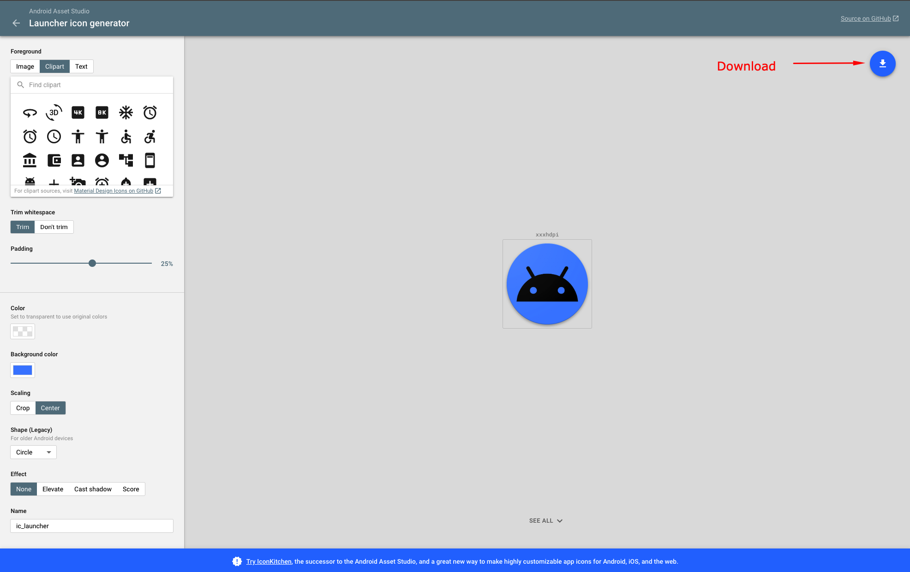

# Change Android Launcher Icon

To change the launcher icon for your Android app, you need to generate a set of icons and replace the default ones in your Flutter project.

### 1. Generate Launcher Icons

1.  You can use an online tool like the [Android Asset Studio](https://romannurik.github.io/AndroidAssetStudio/icons-launcher.html) to generate launcher icons for different screen densities.
2.  Upload your source image (e.g., a 512x512 PNG file).
3.  Customize the icon shape, color, and effects as needed.
4.  Download the generated zip file.

### 2. Replace Icon Files

1.  Extract the downloaded zip file. You will find a `res` folder inside.
2.  Open your Flutter project in your code editor.
3.  Navigate to the `android/app/src/main/` directory.
4.  Replace the existing `res` folder with the one you extracted from the zip file. This will overwrite the default `mipmap` directories with your new icons.

### 3. Verify the Changes

1.  After replacing the files, rebuild your app.
2.  Install the app on an Android device or emulator to see the new launcher icon.

*(Please note that the file paths in your project may be slightly different. The image below shows an example of what to look for.)*