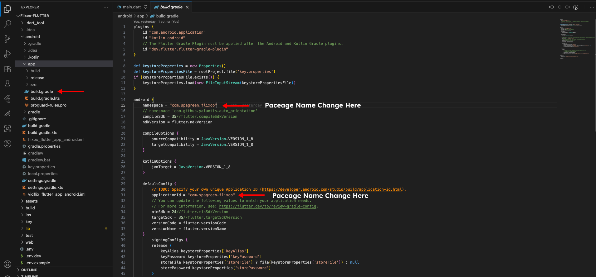
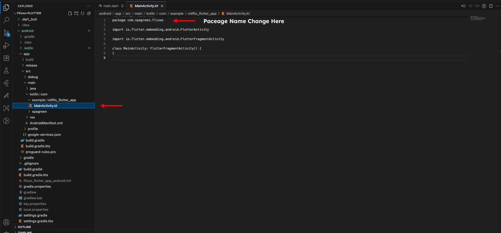

# Change Android Package Name Manually

Changing the Android package name manually is a more involved process, but it gives you full control. Here are the steps to do it:

### 1. Update `build.gradle`

1.  Open `android/app/build.gradle`.
2.  In the `defaultConfig` block, change the `applicationId` to your new package name.

    ```groovy
    defaultConfig {
        applicationId "com.yourcompany.yourapp"
        minSdkVersion 21
        targetSdkVersion 33
        versionCode 1
        versionName "1.0.0"
    }
    ```

### 2. Update `AndroidManifest.xml`

You need to update the package name in three `AndroidManifest.xml` files:

*   `android/app/src/main/AndroidManifest.xml`
*   `android/app/src/debug/AndroidManifest.xml`
*   `android/app/src/profile/AndroidManifest.xml`

In each of these files, update the `package` attribute in the `<manifest>` tag to your new package name.

```xml
<manifest xmlns:android="http://schemas.android.com/apk/res/android"
    package="com.yourcompany.yourapp">
```

Also, in `android/app/src/main/AndroidManifest.xml`, make sure that the `android:name` attribute in the `<activity>` tag is correct. It should be `".MainActivity"`.

### 3. Update `MainActivity.kt` (or `MainActivity.java`)

1.  Navigate to `android/app/src/main/kotlin` (or `android/app/src/main/java`).
2.  The directory structure should reflect your new package name. For example, if your new package name is `com.yourcompany.yourapp`, the directory structure should be `com/yourcompany/yourapp`.
3.  Rename the directories to match your new package name.
4.  Open `MainActivity.kt` (or `MainActivity.java`).
5.  Update the `package` declaration at the top of the file to your new package name.

    ```kotlin
    package com.yourcompany.yourapp
    ```

### 4. Clean and Rebuild

1.  In your terminal, run `flutter clean`.
2.  Then, run `flutter run` to rebuild your app with the new package name.

*(Please note that the file paths and package names in your project may be slightly different. The images below show an example of what to look for.)*



