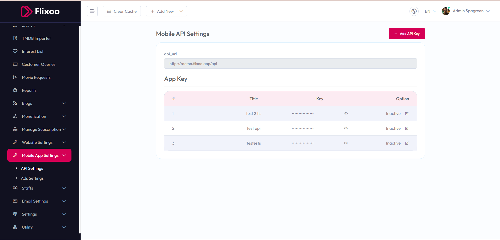
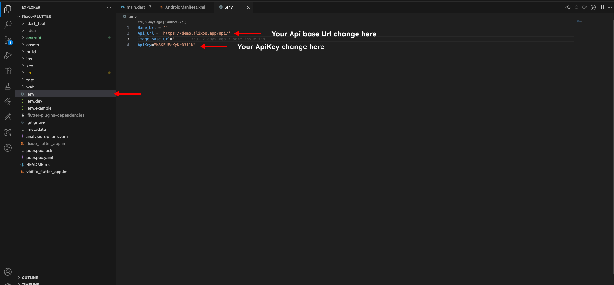
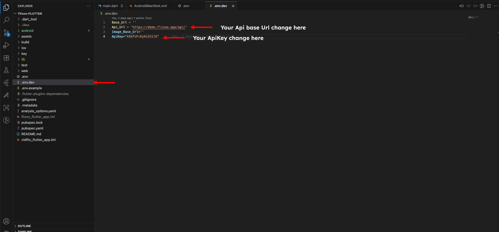

# Change API Server Details

To connect your mobile app to the Flixoo backend, you need to configure the API server details in your Flutter project.

### 1. Get API Details from Admin Panel

1.  Log in to your Flixoo admin panel.
2.  Navigate to **Mobile App > API Setting**.
3.  You will find the **API SERVER URL** and **API KEY**.



### 2. Update Configuration File

1.  Open your Flutter project in your code editor.
2.  Locate the configuration file that stores the API connection details. This file is usually named `config.dart`, `constants.dart`, or something similar, and it is typically located in the `lib` directory.
3.  Inside this file, you will find variables that define the API base URL and the API key. The variable names might be `API_BASE_URL`, `apiKey`, or similar.
4.  Replace the placeholder values with the **API SERVER URL** and **API KEY** you obtained from the admin panel.

    For example, if your code looks like this:

    ```.env

      Api_Url = "https://example.com/api/";
      ApiKey = "your_api_key";
    
    ```

    You would change it to:

    ```.env.dev
    
      Api_Url = "YOUR_API_SERVER_URL_FROM_ADMIN_PANEL";
      ApiKey = "YOUR_API_KEY_FROM_ADMIN_PANEL";
    
    ```

    *(Please note that the variable names and file structure in your project may be different. The images below show an example of what to look for.)*




5.  Save the changes to the file.

After updating the API details, your mobile app will be able to communicate with the CineFlix backend.
