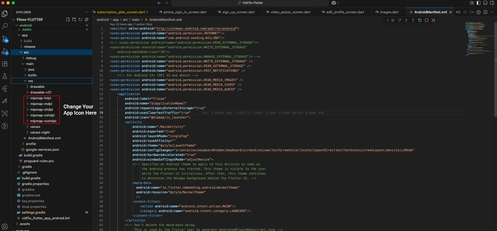

# Change App Icon       

First, you need to generate your app icon. You can use an online app icon generator to create icons for different resolutions.

1.  **Generate App Icons**: Use an online tool like [Android Asset Studio](https://romannurik.github.io/AndroidAssetStudio/icons-launcher.html) or any other app icon generator to create your app icons.
2.  **Download and Extract**: Download the generated zip file and extract it.
3.  **Replace Icons**: Go to `Project » android » app » src » main » res` and replace the existing `mipmap` folders with the ones you extracted.
4.  **Update App Icon in Flutter**: Rename your Icon to `app_icon.png` then copy/paste into directory location: `Project » assets » logos`. Recommended logo size is 512x512.

