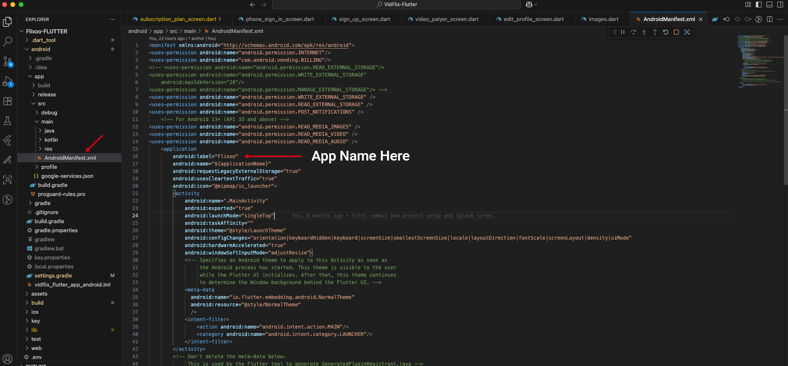

# Change App Name

To change the name of your app, you need to update the configuration files for both Android and iOS.

### Android

1.  Open your Flutter project in your code editor.
2.  Navigate to `android/app/src/main/AndroidManifest.xml`.
3.  Locate the `android:label` attribute within the `<application>` tag.
4.  Replace the existing value with your desired app name.

    ```xml
    <application
        android:name="${applicationName}"
        android:label="Your New App Name"
        android:icon="@mipmap/ic_launcher">
    ```

### iOS

1.  Open your Flutter project in your code editor.
2.  Navigate to `ios/Runner/Info.plist`.
3.  Locate the `CFBundleName` key.
4.  Replace the existing value with your desired app name.

    ```xml
    <key>CFBundleName</key>
    <string>Your New App Name</string>
    ```

*(Please note that the file paths and attribute names in your project may be slightly different. The image below shows an example of what to look for.)*



After changing the app name in the configuration files, rebuild your app to see the new name on the home screen.