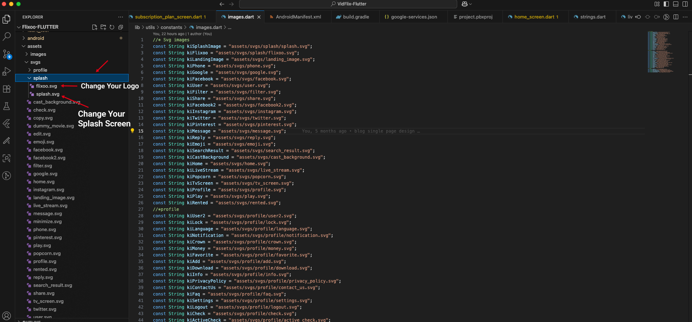

# Change Splash Screen Logo

To change the splash screen logo in your Flutter app, you need to replace the existing logo file with your own.

### 1. Prepare Your Logo

1.  Create your splash screen logo in PNG format.
2.  The recommended size for the splash screen logo is 461x176 pixels, but it can be adjusted based on your design.
3.  Name your logo file `splash_logo.png` (or any other name, but be consistent).

### 2. Replace the Logo File

1.  Open your Flutter project in your code editor.
2.  Navigate to the `assets/images` directory (or wherever your images are stored).
3.  Delete the existing splash screen logo file.
4.  Copy your new logo file into the same directory.

### 3. Update the Code (if necessary)

In some cases, the splash screen logo is defined in the code. You may need to update the file path in your code to point to your new logo.

1.  Search for the code that displays the splash screen. This is often in a file like `splash_screen.dart` or similar.
2.  Look for a line of code that references the splash screen image, for example:

    ```dart
    Image.asset('assets/images/splash_logo.png')
    ```

3.  Make sure the path and filename in the code match your new logo file.

*(Please note that the file paths and variable names in your project may be different. The image below shows an example of what to look for.)*



After replacing the logo file and updating the code if necessary, rebuild your app to see the new splash screen.