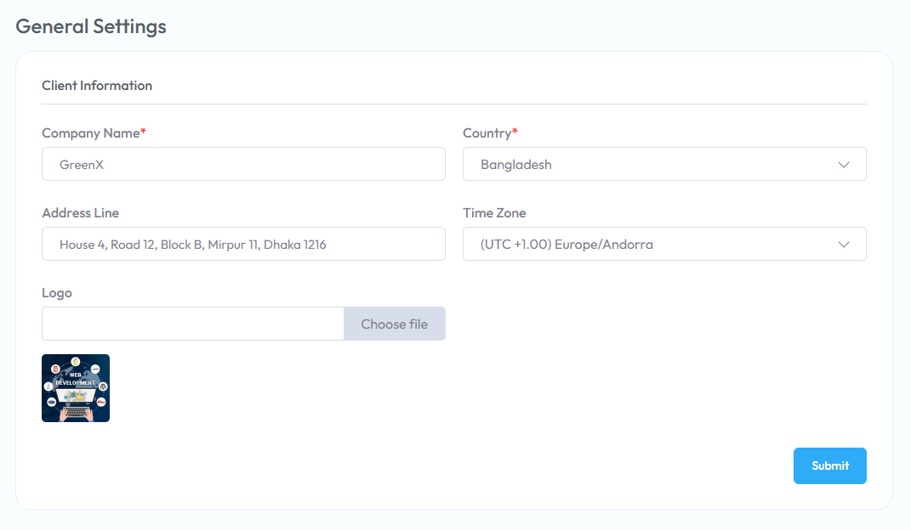
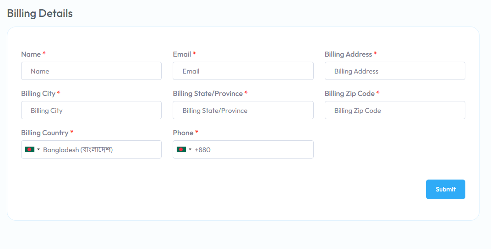

# Settings
To Manage **Settings** follow the procedures…

- Go to **Client Panel** &  click First **General Settings** Then **Billing Details**

 **General Settings**:

From **General Settings** you can choose your Information.

 **Billing Details**:

From **Billing Details** you can change the **Billing Details** For Your Website.

