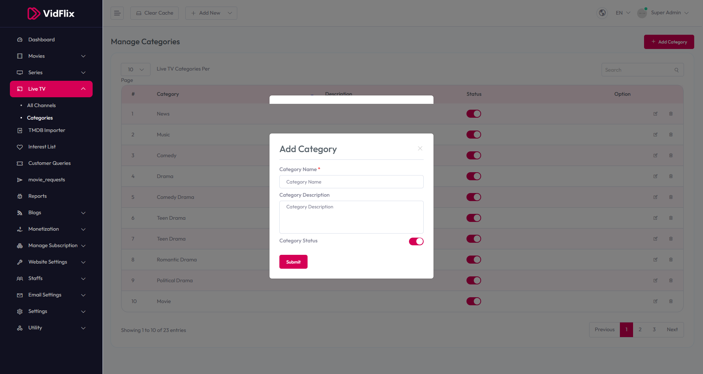

# Add Category

To configure **Add Category**, follow these steps:

1. From the left sidebar, go to **Live TV**.  
2. Click on **Manage Categories**.  
3. Click on **Add Category**.  
4. Enter the required details for adding a new category.

## Available Options
- **Category Name** – Enter the name of the category.  
- **Category Description** – Provide a detailed description of the category.  
- **Category Status** – Toggle to enable or disable the category status.

After entering the details, click the **Submit** button to save settings.

