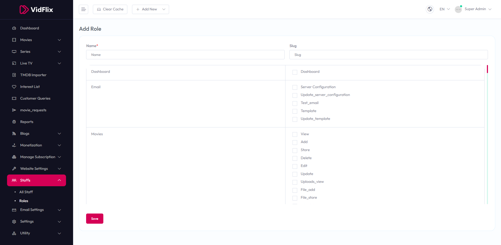

# Add Role

To configure **Add Role**, follow these steps:

1. From the left sidebar, go to **Staffs**.  
2. Click on **Roles**.  
3. Click on **Add Role**.  
4. Enter the required details for adding a new role.

## Available Options
- **Name** – Enter the name of the role.  
- **Slug** – Enter the slug for the role.  
- **Dashboard** – Toggle to enable dashboard access.  
- **Email** – Toggle to enable email access.  
- **Server Configuration** – Toggle to enable server configuration access.  
- **Update_server_configuration** – Toggle to enable update server configuration access.  
- **Test_email** – Toggle to enable test email access.  
- **Update_template** – Toggle to enable update template access.  
- **View** – Toggle to enable view access.  
- **Add** – Toggle to enable add access.  
- **Store** – Toggle to enable store access.  
- **Delete** – Toggle to enable delete access.  
- **Edit** – Toggle to enable edit access.  
- **Uploads_view** – Toggle to enable uploads view access.  
- **File_add** – Toggle to enable file add access.  
- **File_store** – Toggle to enable file store access.

After entering the details, click the **Save** button to save settings.

