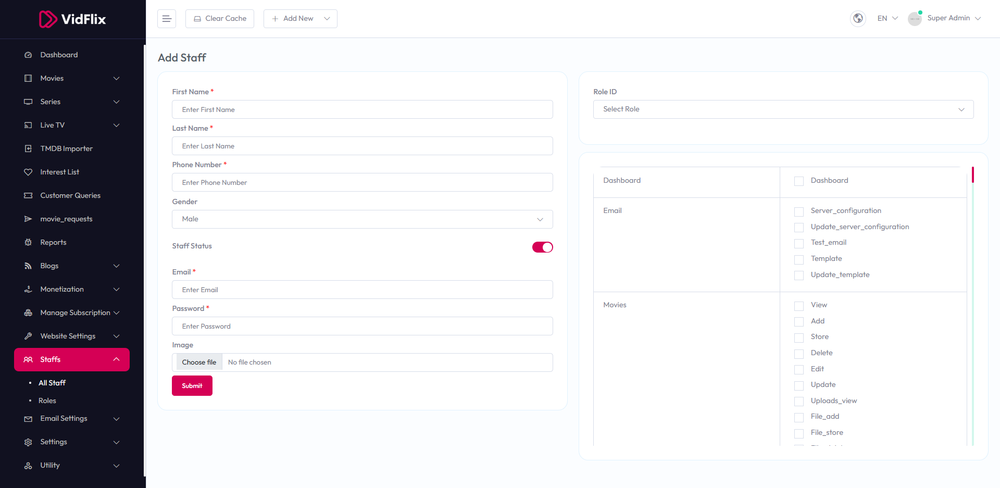

# Add Staff

To configure **Add Staff**, follow these steps:

1. From the left sidebar, go to **Staffs**.  
2. Click on **Manage Staffs**.  
3. Click on **Add Staff**.  
4. Enter the required details for adding a new staff member.

## Available Options
- **Name** – Enter the name of the staff member.  
- **Email** – Enter the email address of the staff member.  
- **Phone** – Enter the phone number of the staff member.  
- **Role** – Select the role from the dropdown.  
- **Password** – Enter a password for the staff member.  
- **Confirm Password** – Re-enter the password for confirmation.  
- **Status** – Toggle to enable or disable the staff member status.

After entering the details, click the **Submit** button to save settings.

