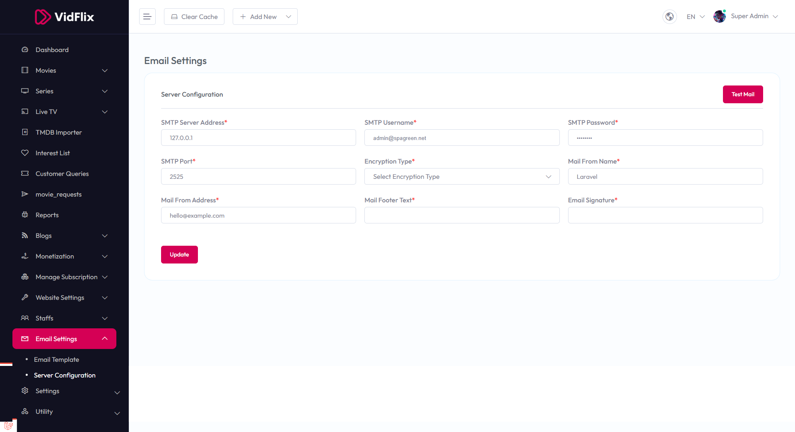

# Email Settings

To configure **Email Settings**, follow these steps:

1. From the left sidebar, go to **Email Settings**.  
2. Click on **Server Configuration**.  
3. Enter the required details for email server integration.

## Available Options

- **SMTP Server Address** – Enter the SMTP server address (e.g., 127.0.0.1).  
- **SMTP Username** – Enter the SMTP username (e.g., admin@spagreen.net).  
- **SMTP Password** – Enter the SMTP password.  
- **SMTP Port** – Enter the SMTP port (e.g., 2525).  
- **Encryption Type** – Select the encryption type from the dropdown.  
- **Mail From Name** – Enter the name to appear as the sender (e.g., Laravel).  
- **Mail From Address** – Enter the email address to appear as the sender (e.g., hello@example.com).  
- **Mail Footer Text** – Enter the text to appear in the email footer.  
- **Email Signature** – Enter the signature to append to emails.

After entering the details, click the **Update** button to save settings. Use the **Test Mail** button to verify the configuration.

