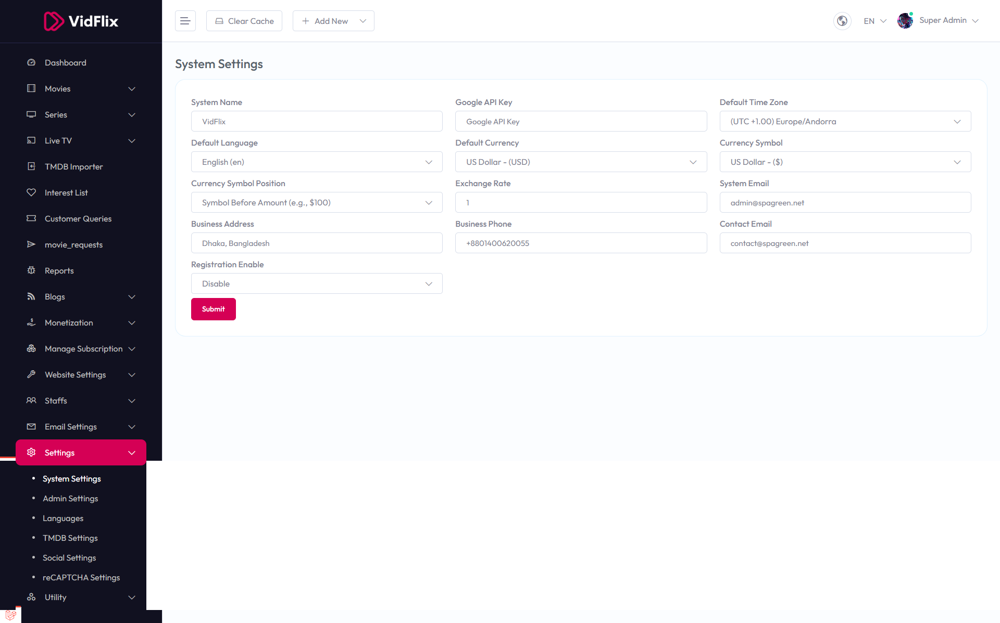

# Settings

To Manage **Settings** follow the procedures…

- Select **System Settings** in the left menu of **Settings**
- You can update your own business information from here. 
- For example, **Company Name**,**Brand Tagline**,**Default Language**,**Currency**,**Time Zone** and many more preferable settings can be updated from here.

