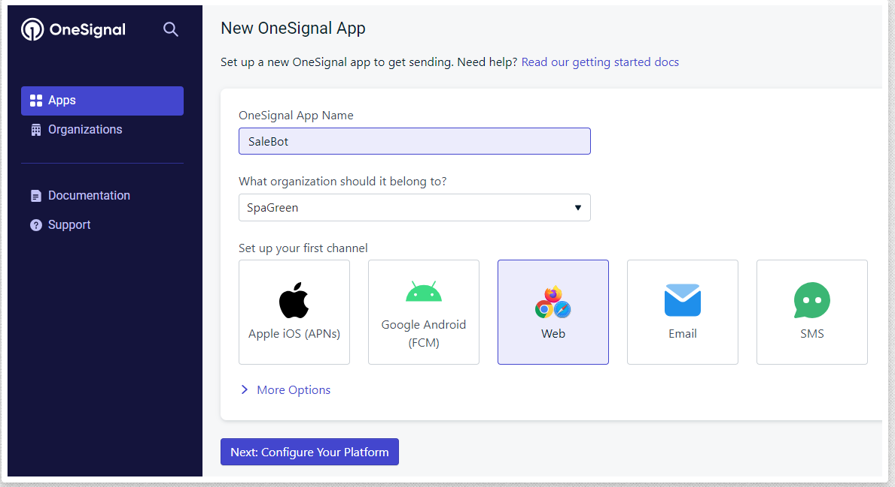
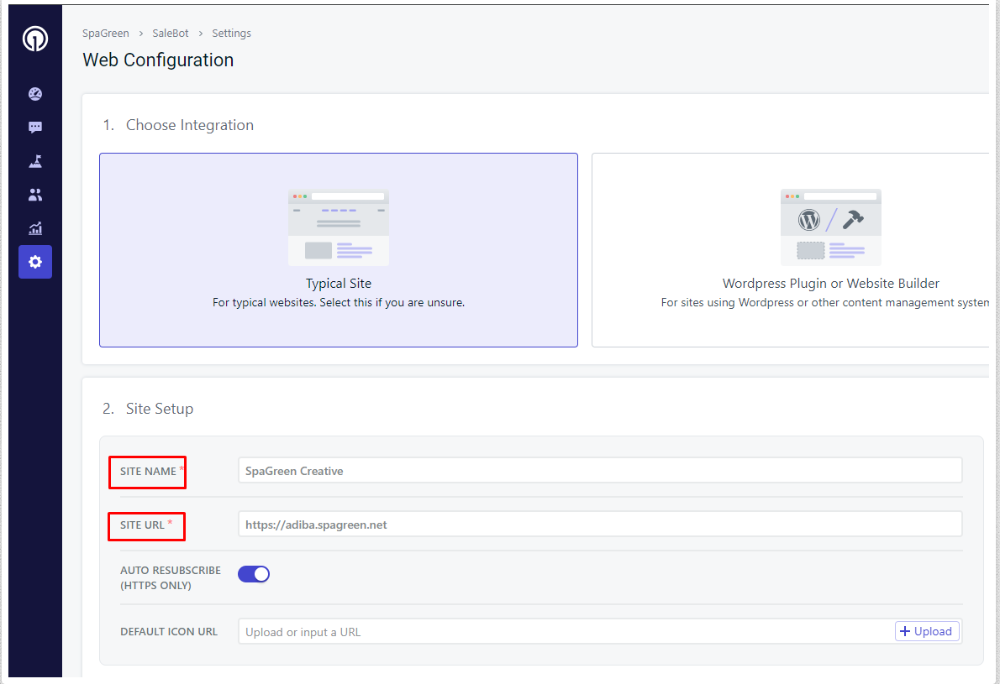
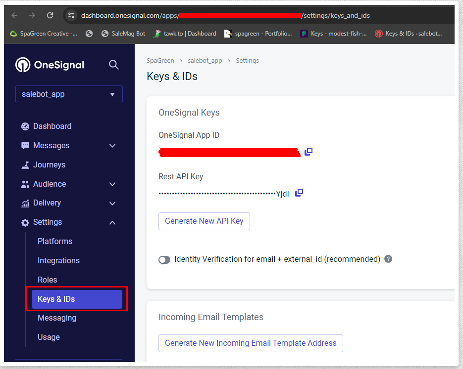

# Onesignal Settings

To Manage **Onesignal Settings** follow the procedures…

- Select **Onesignal** in the left menu of **System Settings**
- To use OneSignal services, you must first register on the website.
- Click here to register if you haven’t registered already. 
- Once logged in, click on Add a New App and provide the necessary details like your app's name and platform.

- Then select the platform you want to integrate like this

- Follow the platform-specific set up by giving site name and site url

- Click the App Keys sidebar menu once the app has been built, and you will see the app keys
- Now it's time to locate the API Keys.
- Navigate to your OneSignal dashboard and locate the API Keys section that need to be added in System Settings->OneSignal in your SaleBot admin panel.

- Copy the keys individually, one by one, and paste them into the SaleBot OneSignal settings, then active the status and click on the submit button. This step ensures seamless communication between your application and OneSignal for effective push notification management.
- Once done, you're all set to leverage the power of push notifications to engage with your users effectively.
