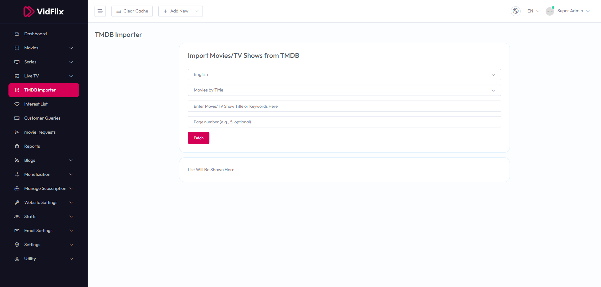

# TMDB Importer

To use the **TMDB Importer**, follow these steps:

1. From the left sidebar, go to **TMDB Importer**.  
2. Select the language from the dropdown (e.g., English).  
3. Select the type from the dropdown (e.g., Movies by Title).  
4. Enter the movie/TV show title or keywords in the input field.  
5. Optionally, enter the page number (e.g., 5).  
6. Click the **Fetch** button to retrieve the data.

The list of imported movies/TV shows will be shown in the area below.

