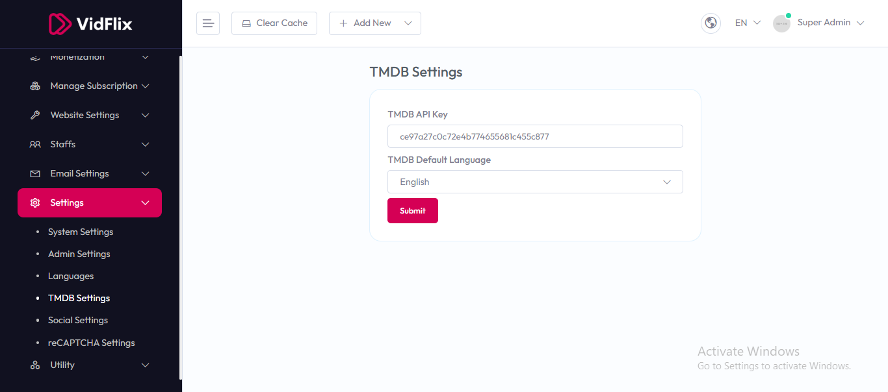

# TMDB Settings

To configure **TMDB (The Movie Database) Settings**, follow these steps:

1. From the left sidebar, go to **Settings**.  
2. Click on **TMDB Settings**.  
3. Enter the required API details for TMDB integration.  

## Available Options

- **TMDB API Key** – Enter your TMDB API key to connect the system with The Movie Database for fetching movies, TV shows, and metadata.  
- **TMDB Default Language** – Choose the default language for TMDB content (e.g., English, Spanish, etc.).  

After entering the details, click the **Submit** button to save settings.  

