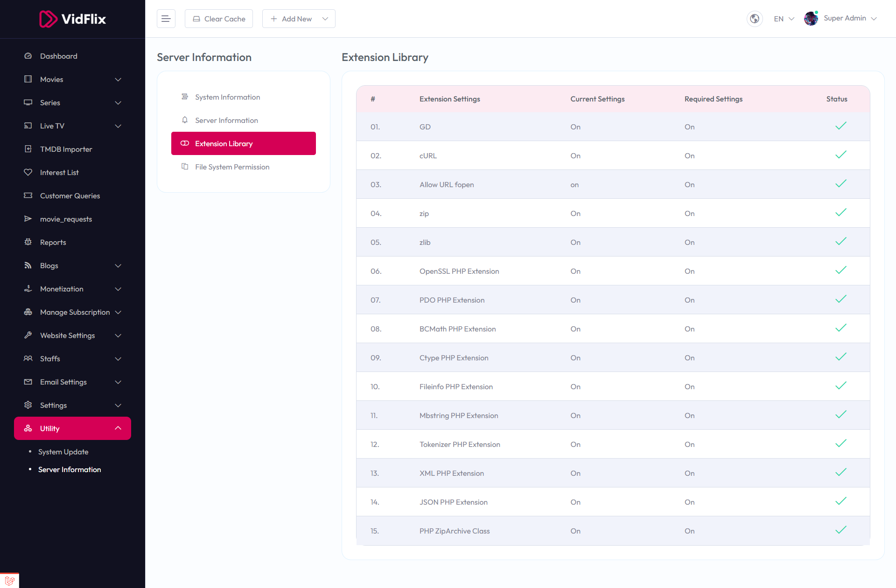
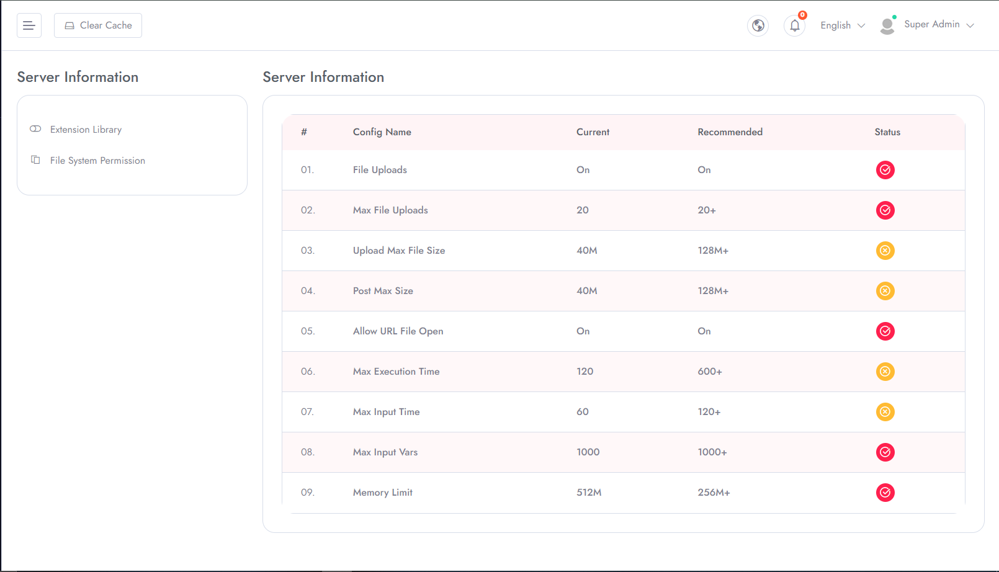

# Server Configuration

To Manage **Server Configuration** follow the procedures…

Select **Utility** in the left menu of the admin area.

&nbsp;

**Server Configuration**

Here you can update your system with latest version .

# Server Information

Here you can find various type of server information like system information, server information, extension
Library and file system permission .

**Update Server Information**

You can update status by tapping switch button.
