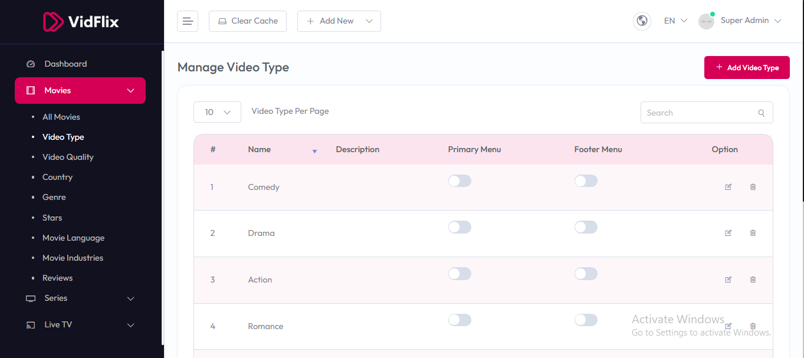

# Manage Video Type

To configure **Manage Video Type**, follow these steps:

1. From the left sidebar, go to **Movies**.  
2. Click on **Video Type**.  
3. Manage the available video types and their settings as needed.

## Available Options

- **#** – Displays the sequence number of the video type.  
- **Name** – Shows the name of the video type (e.g., Comedy, Drama).  
- **Description** – Provides a brief description of the video type.  
- **Primary Menu** – Toggle to enable or disable the video type in the primary menu.  
- **Footer Menu** – Toggle to enable or disable the video type in the footer menu.  
- **Option** – Provides actions like edit or delete for each video type entry.

After making changes, use the **Add Video Type** button to add new video types or the **Save** option to update existing settings.

